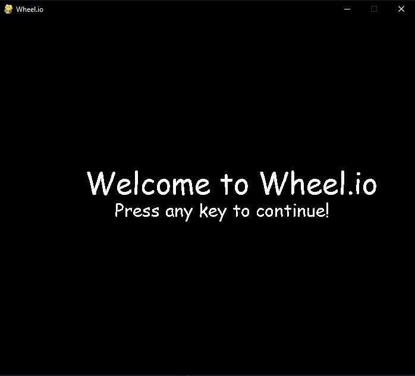

# Wheel.io
## Description
    
    This is Wheel.io, the console wheel picker, an engaging Python application that utilizes the Pygame library to create a simulation of a virtual spinning wheel. The primary function of this application is to select a random option from a predefined list of choices, similar to a prize wheel, my main inspiration whilst doing this project is that game and movie nights have less hassle because we can put our options to the wheel. This project combines elements of game development, graphical interface design, and randomization techniques to provide a fun and useful tool for decision making.

## Table of Contents

- [Usage](#usage)
- [Installation](#installation)
- [Test](#test)
- [Demo](#demo)
- [Test](#test)
- [Report](#report)
- [Questions](#questions)
- [License](#license)
- [Contributing](#contributing)

## Usage
    
    Users can enter their options to spin and see the resulting random choice displayed.

## Installation

## Demo 

## Test

## Report

    To report issues please refer to my contact section.

## Questions

    Contact me for any additional questions: Github- Roesnware Email- bubwub04@gmail.com
    
## License

    
## Contributing
    
    To make contributions please reach out to me on Github or by Email.
